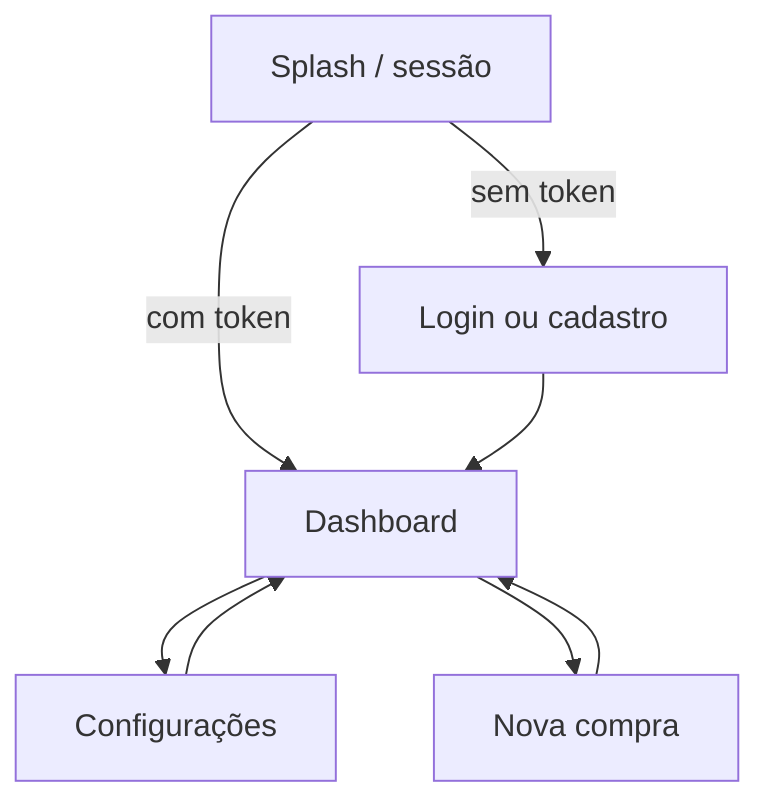

# Wallet Balance

Cartão de crédito full-stack: limite, fatura aberta, extrato de transações e gráficos de gastos por estabelecimento. Front-end **Flutter**; API **.NET 10 Minimal API** com **SQLite**, autenticação **JWT + refresh token** e documentação via **Scalar**.

## Sobre o projeto

| Camada | Tecnologia | Descrição |
|--------|------------|-----------|
| App | Flutter 3.13+ | Login, dashboard, cartão (clássico/moderno), fatura, extrato, gráfico, nova compra |
| API | .NET 10 Minimal API | REST com JWT; cartão, transações, faturas e analytics por usuário |
| Banco | SQLite + EF Core | Migrations automáticas na subida; arquivo `walletbalance.db` |

## Estrutura do monorepo

```
wallet-balance/
├── WalletBalanceBackend/     → [README do backend](WalletBalanceBackend/README.md)
└── wallet-balance-app/       → [README do app](wallet-balance-app/README.md)
```

Documentação complementar:

| Documento | Conteúdo |
|-----------|----------|
| [`wallet-balance-app/README.md`](wallet-balance-app/README.md) | Arquitetura Flutter, testes, coverage, screenshots |
| [`WalletBalanceBackend/README.md`](WalletBalanceBackend/README.md) | Pacotes, migrations, execução e URLs da API |

## Pré-requisitos

- [.NET 10 SDK](https://dotnet.microsoft.com/download)
- [Flutter 3.13+](https://flutter.dev/docs/get-started/install)

## Quick start

### 1. Backend

```bash
cd WalletBalanceBackend
dotnet run
```

A API REST sobe em `http://localhost:5268/api/v1`. O banco é criado/atualizado automaticamente via EF Core migrations (`Database.Migrate()` na inicialização).

Para migrations, pacotes e Scalar, consulte [`WalletBalanceBackend/README.md`](WalletBalanceBackend/README.md).

### 2. App Flutter

```bash
cd wallet-balance-app
flutter pub get
flutter run
```

> O backend deve estar em execução antes de cadastrar, autenticar ou usar o dashboard.

Para arquitetura, testes e coverage, consulte [`wallet-balance-app/README.md`](wallet-balance-app/README.md).

## Integração app ↔ API

Base URL configurada em `wallet-balance-app/lib/src/common/constants/api_constant.dart`:

| Plataforma | URL |
|------------|-----|
| Web / Desktop / iOS | `http://localhost:5268/api/v1` |
| Android Emulator | `http://10.0.2.2:5268/api/v1` |

O app consome a API REST do backend. Endpoints, autenticação e schema do banco estão documentados no [README do backend](WalletBalanceBackend/README.md) e na interface Scalar (`http://localhost:5268/scalar`).

OpenAPI: `http://localhost:5268/openapi/v1.json`

## Funcionalidades

### Autenticação
- Cadastro com seed de cartão de crédito e transações demo para o novo usuário
- Login, refresh token, logout e consulta de perfil (`GET /auth/me`)
- Splash e telas de login/registro no app Flutter (JWT + refresh)

### Cartão de crédito
- Resumo: limite, gasto, disponível, titular e últimos dígitos
- Dois layouts: **clássico** (visual legado) e **moderno** (gradiente + barra de uso)
- Escolha do estilo em Configurações

### Fatura e extrato
- Fatura aberta (`GET /invoices/current`)
- Lista de transações (`GET /transactions`)
- Nova compra via FAB (`POST /transactions`)

### Analytics
- Gráfico de barras por estabelecimento (`fl_chart`, `GET /analytics/spending-by-merchant`)

### Configurações
- Tema escuro persistido localmente
- Preview e seleção do estilo do cartão
- Tela About

## Fluxo do usuário



1. Abra o app; a sessão é verificada automaticamente
2. Cadastre-se ou faça login (seed de cartão e transações demo no registro)
3. Veja cartão, fatura, gráfico e extrato no dashboard
4. Registre compras ou atualize com pull-to-refresh / ícone na AppBar
5. Escolha tema e estilo do cartão em Configurações

## Examples of commits

```
git add . && git commit -m ":rocket: Initial commit." && git push
git add . && git commit -m ":building_construction: Added initial project architecture." && git push
git add . && git commit -m ":building_construction: Update project architecture." && git push
git add . && git commit -m ":memo: Updated project documentation." && git push
git add . && git commit -m ":memo: Updated code documentation." && git push
git add . && git commit -m ":white_check_mark: Added feature xyz." && git push
git add . && git commit -m ":wrench: Fixed xyz usage." && git push
git add . && git commit -m ":heavy_minus_sign: Removed xyz." && git push
git add . && git commit -m ":memo: Adjusted project imports." && git push
git add . && git commit -m ":arrow_up: Updated dependencies." && git push
git add . && git commit -m ":arrow_down: Removed dependencies." && git push
git add . && git commit -m ":wastebasket: Removed unused code." && git push
git add . && git commit -m ":test_tube: Added test functionality xyz." && git push
git add . && git commit -m ":construction_worker: Building in progress." && git push
git add . && git commit -m ":construction_worker: Added CI build system." && git push
```

## License

[MIT License](https://opensource.org/licenses/MIT)

Copyright (c) 2026 William Franco.
