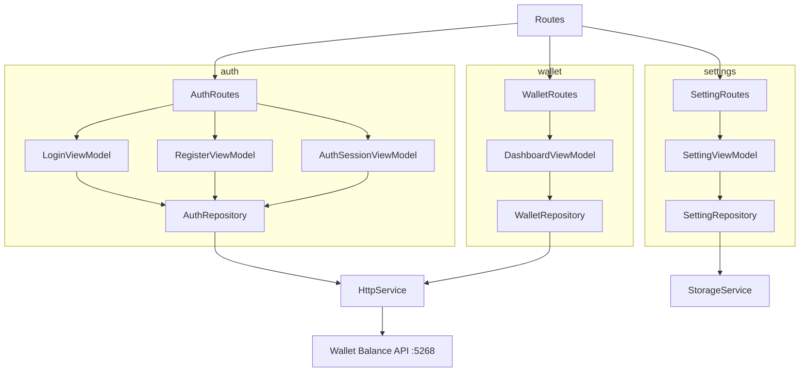

# Wallet Balance App

Flutter client for the Wallet Balance backend (JWT auth, credit card summary, open invoice, transaction list, spending chart with `fl_chart`, classic/modern card UI, settings).

Auth, wallet, and settings live in separate feature modules with MVVM-style view models (`abstract interface` + `*Impl` extending `StateManagement`).

Auth is split into Login, Register, and Session view models; `WalletRepository` calls the REST API at **`http://localhost:5268/api/v1`**; shared services handle HTTP, storage, and connectivity.

Models under `features/*/models/` use `StatePattern` and `ResultPattern`. The wallet module covers dashboard data (card summary, open invoice, transactions), legacy and modern card widgets (legacy uses `assets/logo/`), new purchases via FAB, and merchant spending charts with `fl_chart` (`/analytics/spending-by-merchant`).

## Structure



## Stack

| Technology | Version |
|------------|---------|
| Dart SDK | ^3.13.4 |
| connectivity_plus | ^7.1.1 |
| cupertino_icons | ^1.0.8 |
| dio | ^5.9.2 |
| fl_chart | ^0.70.2 |
| get_it | ^9.2.1 |
| go_router | ^17.2.3 |
| intl | ^0.20.2 |
| shared_preferences | ^2.5.5 |
| flutter_lints | ^6.0.0 |
| build_runner | ^2.15.0 |
| mockito | ^5.6.4 |
| Android Gradle Plugin | 9.1.0 |
| Kotlin | 2.4.0 |
| NDK | 30.0.16248370 |
| compileSdk / targetSdk | 36 |
| minSdk | 29 |
| JVM | 25 |
| iOS Deployment Target | 15.0 |
| Swift | 5.0 |

## Architecture

The project is structured in a modular way, where each new functionality should be a new module containing its particularities, and things common to the entire project should be in the `common` module.

```
src/
    ├── common/
    │   ├── constants/
    │   ├── dependency_injectors/
    │   ├── extensions/
    │   ├── patterns/
    │   ├── routes/
    │   ├── services/
    │   ├── state_management/
    │   └── widgets/
    └── features/
        ├── auth/
        │   ├── models/
        │   ├── repositories/
        │   ├── routes/
        │   ├── view_models/
        │   └── views/
        ├── wallet/
        │   ├── models/
        │   ├── repositories/
        │   ├── routes/
        │   ├── view_models/
        │   └── views/
        └── settings/
            ├── models/
            ├── repositories/
            ├── routes/
            ├── view_models/
            └── views/
```

Note: the `wallet` feature also includes `widgets/` (card layouts, chart) and `exceptions/` alongside the folders above.

## Settings

- Dark theme persisted in `SharedPreferences` (`ValueConstant.darkMode`)
- Card style legacy/modern persisted in `SharedPreferences` (`ValueConstant.cardStyle`), with preview on the settings screen
- About screen with version and copyright
- Access from the settings icon on the dashboard AppBar

## Coverage

flutter pub run build_runner build --delete-conflicting-outputs

flutter test --coverage

genhtml coverage/lcov.info -o coverage/html

open coverage/html/index.html

## ScreenShots

| Image 1 | Image 2 | Image 3 |
|----------|----------|----------|
|  |  |  |

| Image 4 | Image 5 | Image 6 |
|----------|----------|----------|
|  |  |  |

## Commits

```
git add . && git commit -m ":rocket: Initial commit." && git push
git add . && git commit -m ":building_construction: Added initial project architecture." && git push
git add . && git commit -m ":building_construction: Update project architecture." && git push
git add . && git commit -m ":memo: Updated project documentation." && git push
git add . && git commit -m ":memo: Updated code documentation." && git push
git add . && git commit -m ":white_check_mark: Added feature xyz." && git push
git add . && git commit -m ":wrench: Fixed xyz usage." && git push
git add . && git commit -m ":heavy_minus_sign: Removed xyz." && git push
git add . && git commit -m ":memo: Adjusted project imports." && git push
git add . && git commit -m ":arrow_up: Updated dependencies." && git push
git add . && git commit -m ":arrow_down: Removed dependencies." && git push
git add . && git commit -m ":wastebasket: Removed unused code." && git push
git add . && git commit -m ":test_tube: Added test functionality xyz." && git push
git add . && git commit -m ":construction_worker: Building in progress." && git push
git add . && git commit -m ":construction_worker: Added CI build system." && git push
```

## License

[MIT License](https://opensource.org/licenses/MIT)

Copyright (c) 2026 William Franco.
